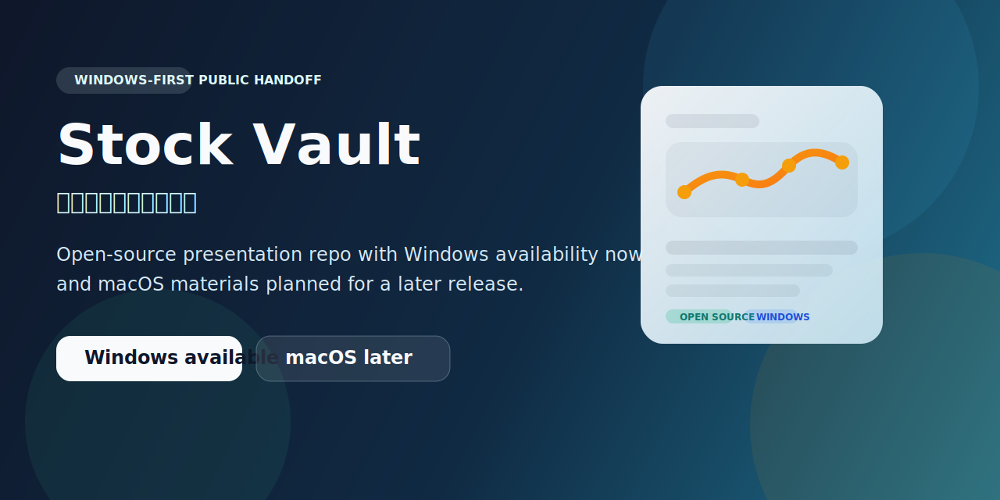

  

<h1 align="center">股市亨通 (Stock Vault)</h1>

<strong>Windows-first open-source public handoff for Stock Vault.</strong>

  A clean public-facing repository for project presentation, Windows-oriented collaboration, and future macOS expansion planning.

  <a href="./docs/README.zh-TW.md">中文說明</a> ·
  <a href="./docs/README.en.md">English Guide</a> ·
  <a href="./docs/platforms/README.md">Platform Guide</a>

  
  
  

## Product Snapshot

Stock Vault is presented here as a curated public handoff package.

This repository is meant to feel like a reliable public front door:

- clear enough for external readers
- honest about current scope
- structured for future collaboration
- ready to expand when macOS materials are introduced later

## Availability

| Area | Current state |
| --- | --- |
| Open source | Public |
| Windows version | Available now |
| macOS version | Not included in this package yet |
| Future macOS support | Can be added later if needed |
| Repository focus | Windows-first public handoff |

## Why This Repository Exists

This repository is designed to support three practical goals:

1. present Stock Vault clearly in public
2. provide a Windows-first handoff package that others can review and reference
3. keep the documentation structure ready for future macOS expansion

## What You Can Expect

- polished landing page and bilingual documentation
- Windows-first positioning that is easy to understand
- representative Tauri / Rust implementation files
- selected tests and public-facing materials
- contribution, security, and conduct guidance for collaborators

## Scope

This is not presented as the complete internal or cross-platform source tree.

Instead, it is a curated public package that currently includes:

- public documentation
- license information
- selected test coverage
- representative implementation files
- collaboration and repository standards

## Platform Direction

### Windows

- the current primary public platform
- the platform external readers should treat as the reference point
- the basis for current repository messaging

### macOS

- not bundled into this public package yet
- intentionally reserved as a future expansion track
- can be documented and added later without restructuring the repository

## Quick Links

- [中文說明](./docs/README.zh-TW.md)
- [English Guide](./docs/README.en.md)
- [Platform Guide](./docs/platforms/README.md)
- [Contributing](./CONTRIBUTING.md)
- [Security](./SECURITY.md)
- [Code of Conduct](./CODE_OF_CONDUCT.md)
- [License](./LICENSE)

## License

This repository is released under the [MIT License](./LICENSE).
